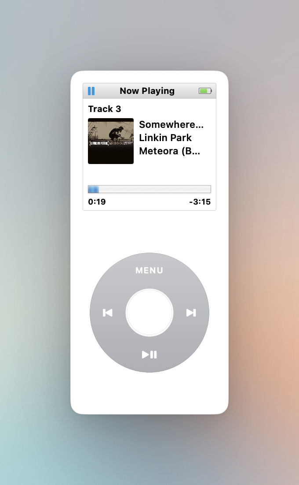

# MacPod

A tiny iPod Nano (technically Nano 1) on your Mac that controls whatever's playing.



It looks like a first-gen iPod Nano and behaves like one. The clickwheel does what you'd expect — play, pause, skip. It shows the track, artist, album, artwork, and a proper blue-striped progress bar. It works with Apple Music, Spotify, YouTube, browsers, podcast apps — basically anything the Mac's system "Now Playing" knows about.

## Features

- **Floating or Window mode** — keep it hovering always-on-top, or drop it into a Mission Control space as a regular window.
- **Light or dark shell** — it can show either a white or a black iPod, following your system dark mode. 
- **Menu bar icon** — click it for show/hide, transport, settings, quit.
- **Battery indicator** — the little icon in the screen header reflects your actual Mac battery.

## Install

1. Download the latest `MacPod.app.zip` from the [releases page](https://github.com/ymolodtsov/macpod/releases/latest).
2. Unzip it and drag **MacPod.app** into your Applications folder.
3. The first time you launch it, macOS will refuse — the app isn't signed by a paid Apple Developer account. To get past Gatekeeper:

   **Option A — right-click open (simplest):**
   - In Finder, **right-click** MacPod.app and choose **Open**.
   - Click **Open** in the warning dialog.
   - You only need to do this once.

   **Option B — remove the quarantine flag in Terminal:**
   ```sh
   xattr -dr com.apple.quarantine /Applications/MacPod.app
   ```
   Then double-click to launch normally.

MacPod lives in your menu bar (the little play/pause icon). Click it for the menu.

## Requirements

- macOS 13 or later (tested up to macOS 26 / Tahoe).

## Building from source

If you'd rather build it yourself:

```sh
git clone https://github.com/ymolodtsov/macpod.git
cd macpod
./Scripts/build-app.sh
open build/MacPod.app
```

Requires Xcode command-line tools. The bundled media-remote adapter is pre-built; to rebuild it from its upstream source, run `./Scripts/rebuild-adapter.sh` (needs `cmake` and `ninja`).

## Credits

Uses the excellent [mediaremote-adapter](https://github.com/ungive/mediaremote-adapter) to talk to macOS's private MediaRemote framework in a way that still works on modern macOS.

## License

MIT.
